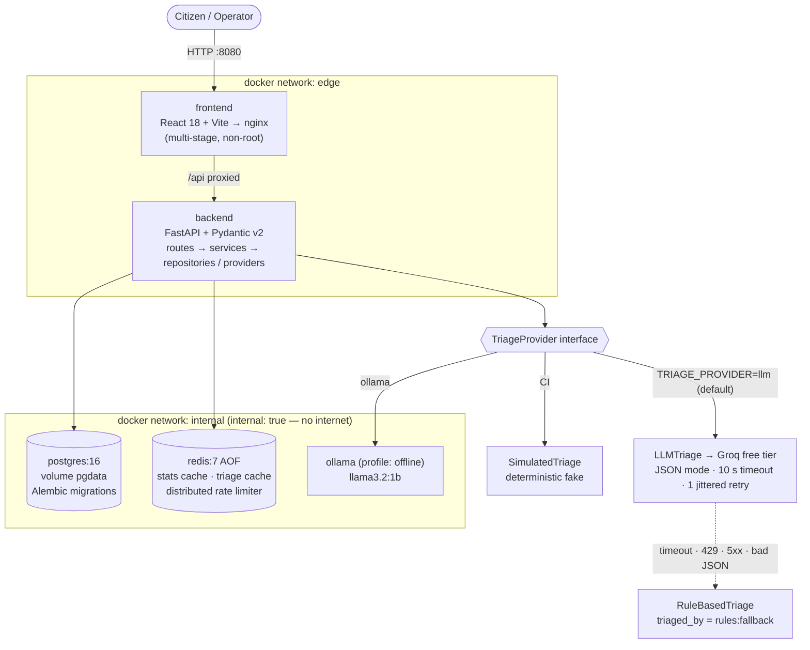
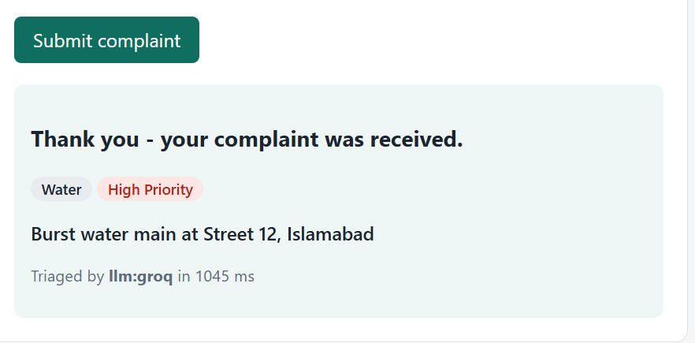
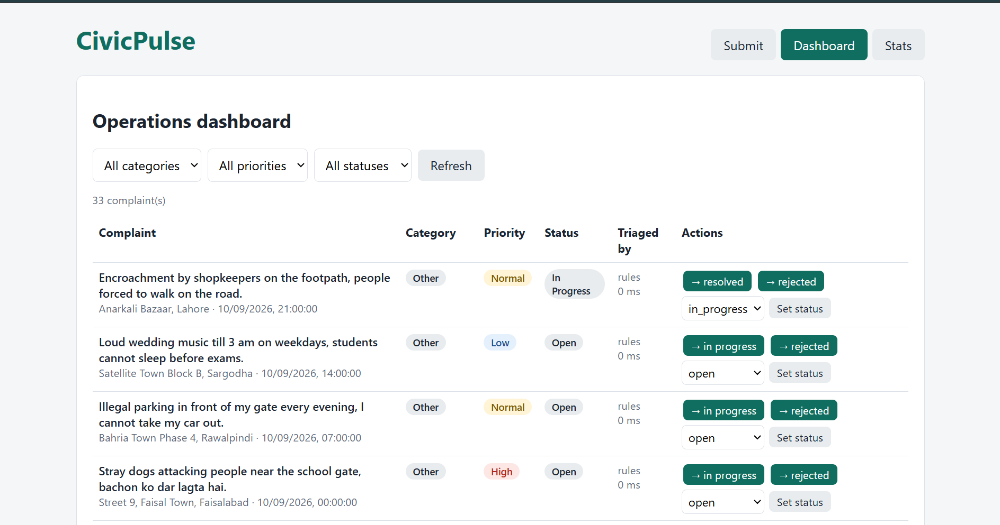
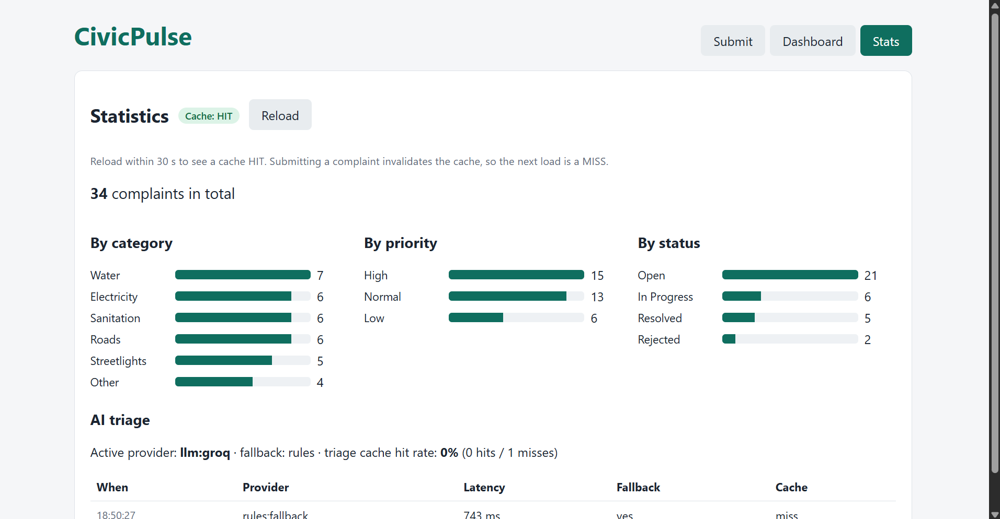

# CivicPulse

[](https://github.com/ammnkhan6353-cmd/civicpulse/actions/workflows/ci.yml)
[](https://github.com/ammnkhan6353-cmd/civicpulse/actions/workflows/cd.yml)


**Municipal complaint intake, AI triage and operations platform** — CS4032 Software Construction and Design, Assignment 01.

## The problem

A citizen reports *"burst water main flooding Street 12 since fajr, water entering ground floors"* into a form. The free text lands in an unsorted queue; on Monday it sits behind three streetlight complaints, and by the time a human reads it the street is flooded. Dropdowns don't fix it — citizens pick "Other" and cannot judge urgency. The information is in the text; somebody has to read it.

CivicPulse reads it. Every complaint is validated, **triaged by a language model into a category, a priority and a one-line summary**, stored durably, and shown on a live operations dashboard. The engineering point is that **the reader is replaceable**: a hosted LLM today, a local model or a keyword ruleset tomorrow — and when the clever reader is slow, rate-limited or wrong, the system falls back to rules instead of failing the citizen.

## Architecture



Only the backend joins both networks, so the internet-facing frontend has **no route to the database**:

```console
$ docker compose exec frontend ping -c1 postgres
ping: bad address 'postgres'
```

## Quickstart (one command)

Prerequisites: Docker Desktop (or Docker Engine + Compose v2) and Git.

```bash
git clone https://github.com/ammnkhan6353-cmd/civicpulse.git civicpulse && cd civicpulse
cp .env.example .env && docker compose up -d
```

Open **http://localhost:8080** — the dashboard already has 33 seeded complaints. API docs: http://localhost:8000/docs.

On Windows PowerShell use `Copy-Item .env.example .env; docker compose up -d`.

- **AI triage:** put your own free key from <https://console.groq.com> into `GROQ_API_KEY` in `.env`, then `docker compose up -d` again. Without a key, everything still works — complaints are triaged by the keyword rules and marked `rules:fallback`.
- **Fully offline:** set `TRIAGE_PROVIDER=ollama` in `.env`, then
  ```bash
  docker compose --profile offline up -d
  docker compose exec ollama ollama pull llama3.2:1b
  ```

Stop with `docker compose down` (data is kept in named volumes; `down -v` deletes it).

## Kubernetes (second command)

Needs `k3d` and `kubectl`. From the repository root:

```bash
k3d cluster create civicpulse --agents 2 -p "8081:80@loadbalancer"
docker build -t civicpulse-backend:dev backend && docker build -t civicpulse-frontend:dev frontend
k3d image import civicpulse-backend:dev civicpulse-frontend:dev -c civicpulse
kubectl apply -k k8s/overlays/dev
```

Then open **http://localhost:8081**. The overlay runs 2× backend, 2× frontend, Postgres as a StatefulSet with a PVC, Redis with a PVC, a Traefik Ingress (`/` → frontend, `/api` → backend), an HPA (2–10 pods at 60 % CPU), a VPA in recommender mode and a PodDisruptionBudget. Deploy, rollback and load-test procedures are in [docs/RUNBOOK.md](docs/RUNBOOK.md).

## API

| Method | Path | Behaviour |
|---|---|---|
| POST | `/api/complaints` | Validate → triage → persist. **201**; **400** with field-level errors; **429** + `Retry-After` over the rate limit |
| GET | `/api/complaints/{id}` | **200** / **404** |
| GET | `/api/complaints` | Filter by `category`, `priority`, `status`; paginate with `page`, `page_size` (≤ 100); returns `total` |
| PATCH | `/api/complaints/{id}/status` | Enforces the state machine; invalid transition → **409** `"Invalid transition: resolved → open"` |
| GET | `/api/stats` | Aggregates by category / priority / status; Redis-cached 30 s; `X-Cache: HIT\|MISS`; invalidated on every write |
| GET | `/api/meta/providers` | Active triage provider, triage-cache hit rate, last 20 outcomes (provider, latency ms, fallback, cache hit) |
| GET | `/health` | Liveness — process alive; touches nothing external |
| GET | `/ready` | Readiness — 200 only if Postgres and Redis answer; 503 `{"failed": ["postgres"]}` otherwise |
| GET | `/metrics` | Prometheus: request count, request latency histogram, triage latency, fallback counter |
| GET | `/docs` | Interactive OpenAPI documentation (the typed frontend client is generated from this schema) |

Status state machine: `open → in_progress → resolved`, `open → rejected`, `in_progress → rejected`; `resolved` and `rejected` are terminal.

## Screenshots

| Submit | Dashboard | Stats |
|---|---|---|
|  |  |  |

HPA scale-out under load: [docs/evidence/scaling-chart.png](docs/evidence/scaling-chart.png) · [hpa-watch.txt](docs/evidence/hpa-watch.txt)

## Repository layout

```
backend/    FastAPI app — app/{routes,services,repositories,providers}, alembic/, tests/
frontend/   React + Vite + TypeScript — src/{api,components,pages}, tests/, nginx.conf
k8s/        Kustomize base + overlays/{dev,prod}
load/       k6 load test + chart script
docs/       ADRs, RUNBOOK, ENGINEERING-NOTES, TRIAGE, AI-USAGE, evidence/
scripts/    check_submission.py (pre-submission lint)
```

## Development

```bash
# backend (Python 3.12)
cd backend && python -m venv .venv && . .venv/bin/activate   # Windows: .venv\Scripts\activate
pip install -r requirements-dev.txt
TRIAGE_PROVIDER=simulated pytest --cov=app                    # deterministic, no network
ruff check . && mypy app

# frontend (Node 22)
cd frontend && npm ci && npm test && npm run lint && npm run typecheck
```

**Regenerate the typed client** after changing any backend schema (CI fails if it drifts):

```bash
cd backend && python -m app.export_openapi openapi.json && cd ../frontend && npm run gen:api
```

## Documentation

- [ADR 0001 — Triage provider interface](docs/adr/0001-provider-interface.md)
- [ADR 0002 — Frontend runtime configuration](docs/adr/0002-frontend-runtime-config.md)
- [ADR 0003 — Deploy by commit SHA](docs/adr/0003-deploy-by-sha.md)
- [ADR 0004 — PII and data governance](docs/adr/0004-pii-and-data-governance.md)
- [RUNBOOK](docs/RUNBOOK.md) · [TRIAGE](docs/TRIAGE.md) · [ENGINEERING-NOTES](docs/ENGINEERING-NOTES.md) · [AI-USAGE](docs/AI-USAGE.md)

Backend framework: **FastAPI** (recommended option). Kubernetes manifests: **Kustomize**.

## License

MIT — see [LICENSE](LICENSE).
